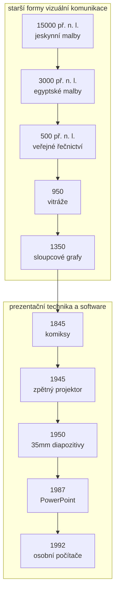

# Kapitola 1 - Prezentace jako sdělení

<strong>Doporučený čas:</strong> 4-6 vyučovacích hodin 
<strong>Výstup kapitoly:</strong> Rozhodneš, zda má být výstup dokument, poznámky řečníka (teleprompter) nebo prezentace, a upravíš přeplněný slide tak, aby podporoval mluvené sdělení.

## Motivace

Prezentace není soubor hezky vybarvených slidů. Je to situace, ve které se někdo snaží předat myšlenku publiku. Slidy v tom mohou velmi pomoci, ale také mohou všechno pokazit. Když je na slidu příliš mnoho textu, publikum začne číst a přestane poslouchat. Když je slide jen dekorace bez vztahu k tomu, co říkáme, publikum sice něco vidí, ale neví, proč to vidí.

Prezentace nezačaly PowerPointem. Jsou pokračováním dlouhé historie vizuální komunikace: lidé se dlouho učili propojovat obraz, text, data, příběh a mluvený projev tak, aby publikum sdělení nejen slyšelo, ale také vidělo.

## Co se naučíš

- rozlišit dokument, poznámky řečníka a prezentaci,
- vysvětlit, proč přeplněný slide nefunguje jako vizuální pomůcka,
- používat pojem `slidedument`,
- určit, kdy má publikum číst a kdy poslouchat,
- převést textový slide do stručné vizuální podoby.

## Výklad

### Vizuální komunikace je starší než software

Moderní prezentační programy svádějí k dojmu, že prezentování začíná výběrem šablony. Ve skutečnosti začíná sdělením. Člověk chce někomu něco ukázat, vysvětlit, obhájit nebo navrhnout. Obraz je silný právě proto, že dokáže zkrátit cestu k porozumění: publikum často rychleji pochopí vztah, kontrast nebo směr pohybu z obrázku než z dlouhého odstavce.

To ale neznamená, že každý obsah má být na slidu. Slide má pomáhat ve chvíli, kdy řečník mluví. Pokud je hlavním cílem předat podrobný text, tabulku, přesné zadání nebo návod, je často lepší vytvořit dokument.

### Dokument, poznámky řečníka, prezentace

Pro tvorbu prezentací je důležité rozlišit tři podobné, ale odlišné výstupy:

| Typ výstupu | Co dělá publikum | Kdy se hodí |
| --- | --- | --- |
| Dokument | čte samostatně | podrobný návod, zápis, zpráva, materiál k pozdějšímu studiu |
| Poznámky řečníka (teleprompter) | čte řečník | scénář, příprava projevu, opora pro vystoupení |
| Prezentace | poslouchá řečníka a sleduje vizuální oporu | vysvětlování, obhajoba, přesvědčování, společná diskuse |

Největší problém vzniká, když se tyto typy smíchají. Slide se tváří jako prezentace, ale ve skutečnosti je to dokument promítnutý na zeď. Publikum ho začne číst rychleji, než řečník mluví, a pozornost se rozpadne.

### `Slidedument`

Pro slide, který je současně slidem i dokumentem, se někdy používá pojem `slidedument`. Obsahuje tolik textu, odrážek a detailů, že už neslouží jako vizuální opora. Spíše připomíná stránku dokumentu vmáčknutou do formátu prezentace.

`Slidedument` bývá lákavý, protože působí bezpečně. Autor má pocit, že na nic nezapomene. Ve skutečnosti ale přenáší zodpovědnost na publikum: "Přečtěte si to sami." Dobrá prezentace funguje opačně. Řečník vybírá, co je podstatné, a slide mu pomáhá tuto volbu ukázat.

### Číst, nebo poslouchat?

Při tvorbě každého slidu si polož jednoduchou otázku:

> Má publikum tento obsah hlavně číst, nebo má poslouchat mě?

Pokud má posluchač slide číst, vytvoř doprovodný dokument nebo handout. Pokud má poslouchat, slide zjednoduš. Na slidu ponech jen to, co pomáhá porozumět právě vysvětlované myšlence: klíčové slovo, číslo, obrázek, schéma, kontrast nebo otázku.

## Praktický úkol

Vyber si přeplněný slide, například ze starší školní prezentace. Pokud žádný nemáš, vytvoř pracovní slide s nadpisem, šesti odrážkami a dlouhým textem.

1. Přepiš stejný obsah jako **dokument**. Může mít odstavce, podrobnosti a vysvětlení.
2. Přepiš stejný obsah jako **poznámky řečníka**. Mají pomoci tobě, ne publiku.
3. Vytvoř z něj **prezentační slide**. Ponech jen jednu hlavní myšlenku.
4. Ve dvojici si ověř, která verze se lépe čte a která se lépe poslouchá.

## Tahák

| Pojem | Význam |
| --- | --- |
| `message` | hlavní sdělení, které si má publikum odnést |
| prezentace | mluvené sdělení podpořené obrazem |
| dokument | text určený k samostatnému čtení |
| poznámky řečníka (teleprompter) | text určený hlavně pro řečníka |
| `slidedument` | přeplněný slide, který se snaží být dokumentem |

## Co už umím

<ul class="checklist">
<li>Vysvětlím, proč prezentace nezačíná výběrem šablony.</li>
<li>Rozliším dokument, poznámky řečníka a prezentaci.</li>
<li>Poznám `slidedument`.</li>
<li>Upravím přeplněný slide na stručnou vizuální oporu.</li>
<li>Rozhodnu, zda má publikum číst, nebo poslouchat.</li>
</ul>

## Návaznost na ŠVP

- tvorba digitálního obsahu,
- volba vhodného digitálního nástroje podle účelu,
- prezentace výsledků vlastní práce,
- kritické posouzení formy a srozumitelnosti digitálního výstupu.
