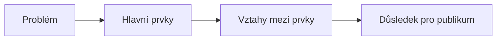

# Kapitola 3 - Vizuální příběh a diagramy

<strong>Doporučený čas:</strong> 6-8 vyučovacích hodin 
<strong>Výstup kapitoly:</strong> Převádíš vztahy, procesy a abstraktní pojmy do diagramů, které publiku pomáhají pochopit strukturu sdělení.

## Motivace

Některé myšlenky se těžko vysvětlují jen slovy. Jak ukázat, že jeden prvek ovlivňuje druhý? Jak vysvětlit, že proces má několik kroků? Jak publiku představit systém, ve kterém se více částí navzájem doplňuje?

Diagram není ozdoba. Je to způsob přemýšlení. Když kreslíme vztahy mezi prvky, často sami zjistíme, co je v našem vysvětlení nejasné. Dobrý diagram tedy pomáhá publiku i autorovi.

## Co se naučíš

- rozeznat základní typy vztahů, které lze ukázat diagramem,
- vybrat vhodný diagram podle sdělení,
- převést abstraktní myšlenku do jednoduchého vizuálního návrhu,
- kombinovat více diagramových principů,
- postupně odhalovat složitější systém.

## Výklad

### Od nápadu k obrazu

Ve *slide:ology* se práce s vizuálním příběhem opírá o schopnost převádět slova na obrazy. Nejde o kreslířský talent. Jde o rozhodnutí, jaký vztah mezi prvky chceme ukázat.

Před tvorbou diagramu si polož otázky:

- Mluvím o pořadí kroků?
- Mluvím o částech celku?
- Mluvím o skupinách?
- Mluvím o vlivu, směru nebo pohybu?
- Mluvím o hierarchii?
- Mluvím o porovnání?

Teprve potom vybírej tvar.

### Abstraktní vztahy

Výběr ze *slide:ology* ukazuje několik rodin diagramů. Pro školní práci si je zjednodušíme takto:

| Typ | Kdy se hodí | Příklad |
| --- | --- | --- |
| `flow` | když ukazuješ pořadí nebo proces | postup registrace, cesta dat, plán projektu |
| `structure` | když ukazuješ uspořádání částí | organizační schéma, vrstvy systému, strom témat |
| `cluster` | když ukazuješ skupiny nebo překryvy | témata brainstormingu, podobnosti a rozdíly |
| `radiate` | když něco vychází z jednoho středu | hlavní téma a jeho důsledky, nápady kolem problému |

Každý typ vede publikum jiným způsobem. `Flow` říká "jdi tímto směrem". `Structure` říká "takhle to drží pohromadě". `Cluster` říká "tyto věci patří k sobě". `Radiate` říká "toto je střed a kolem něj jsou souvislosti".

### Realističtější vztahy

Některé diagramy vycházejí z představitelné situace:

| Typ sdělení | Co ukazuje |
| --- | --- |
| proces | jak něco vzniká nebo probíhá |
| odhalení | vnitřní stav, skrytou část nebo příčinu |
| směr | odkud kam se něco pohybuje |
| umístění | kde se něco nachází |
| vliv | jak jeden prvek působí na jiný |

Tyto diagramy se hodí například při vysvětlování mapy školy, průběhu projektu, cesty informace internetem nebo vztahu mezi uživatelem a aplikací.

### Diagram jako příběh

Složitější systémy je lepší neukázat najednou. Publikum potřebuje čas, aby pochopilo jednotlivé vztahy. Proto můžeš diagram stavět postupně:

Tento postup není jen technika animace. Je to způsob řízení pozornosti. Když publikum vidí všechno najednou, často neví, kam se dívat. Když prvky přidáváš postupně, dáváš mu cestu.

### Doplněno pro tuto učebnici: diagramy v digitálních nástrojích

Diagram může vzniknout mnoha způsoby:

| Nástroj | Kdy se hodí |
| --- | --- |
| papír nebo tabule | rychlý návrh bez ladění vzhledu |
| prezentační software | jednoduché tvary, šipky, ikony |
| sdílená nástěnka | týmové třídění a přesouvání prvků |
| Mermaid | přesný textový zápis jednoduchých schémat |

Nejdřív řeš vztahy, potom vzhled. Hezký diagram, který neodpovídá sdělení, je pro prezentaci slabší než jednoduchý náčrt, který publikum okamžitě pochopí.

## Praktický úkol

Vyber si jeden školní nebo digitální proces. Může to být například odevzdání úkolu, tvorba skupinové prezentace, cesta e-mailu, plánování školní akce nebo práce s online formulářem.

1. Napiš jednou větou, co má publikum pochopit.
2. Rozhodni, zda je hlavní vztah `flow`, `structure`, `cluster` nebo `radiate`.
3. Nakresli první návrh na papír.
4. Vytvoř digitální verzi.
5. Ukaž ji spolužákovi bez vysvětlování a zeptej se, co z ní pochopil.
6. Uprav diagram podle zpětné vazby.

## Tahák

| Když chci ukázat... | Použiju spíše... |
| --- | --- |
| pořadí kroků | `flow` |
| části celku | `structure` |
| skupiny | `cluster` |
| vazby kolem středu | `radiate` |
| změnu v čase | proces nebo časovou osu |
| skrytou příčinu | odhalení nebo vrstvy |

## Co už umím

<ul class="checklist">
<li>Vyberu diagram podle vztahu, ne podle toho, který tvar vypadá zajímavě.</li>
<li>Rozliším `flow`, `structure`, `cluster` a `radiate`.</li>
<li>Převedu abstraktní myšlenku do jednoduchého schématu.</li>
<li>Vím, kdy je vhodné diagram odhalovat postupně.</li>
<li>Ověřím srozumitelnost diagramu na spolužákovi.</li>
</ul>

## Návaznost na ŠVP

- vizualizace informací,
- tvorba a úprava digitálního obsahu,
- modelování vztahů a procesů,
- komunikace a prezentace výsledků.
