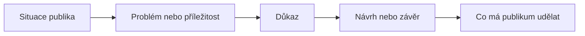

# Kapitola 6 - Předvedení a týmový projekt

<strong>Doporučený čas:</strong> 8-12 vyučovacích hodin 
<strong>Výstup kapitoly:</strong> Připravíš a předvedeš týmovou prezentaci, ve které slidy podporují mluvený projev a tým umí obhájit obsah, design i spolupráci.

## Motivace

Prezentace není hotová ve chvíli, kdy je hotový poslední slide. Je hotová až tehdy, když ji někdo srozumitelně předvede publiku. Dobré slidy samy neodprezentují myšlenku. Řečník musí vědět, co říká, proč to říká a jak slidy používá.

`Delivery` je jednou ze tří částí prezentačního ekosystému. Zahrnuje mluvení, tempo, kontakt s publikem, práci s pauzou, pohybem i s technikou. V této kapitole spojíme předvedení s týmovou prací a závěrečným projektem.

## Co se naučíš

- používat slide jako oporu příběhu, ne jako text ke čtení,
- plánovat animace a postupné odhalování,
- poznat, kdy pohyb na slidu ruší,
- pracovat s délkou prezentace a počtem slidů,
- organizovat týmovou tvorbu v kolaboračním prostředí,
- připravit závěrečnou prezentaci a obhajobu.

## Výklad

### `Delivery`: sdělení musí dojít k publiku

Dobrá `delivery` neznamená divadelní výkon. Znamená, že publikum rozumí tomu, co říkáš, a ví, proč to sleduje. Řečník nemá soutěžit se svými slidy. Slidy mají podporovat jeho výklad.

Základní pravidla:

- nemluv jen k plátnu,
- nečti dlouhé odrážky,
- udržuj tempo, které publikum stíhá,
- používej pauzy,
- vysvětluj, proč je každý slide na místě,
- zkoušej prezentaci nahlas.

### Pohyb a animace

Animace mohou pomoci, když řídí pozornost nebo ukazují změnu. Mohou ale také rušit. Důležité pravidlo zní: samotná existence animační funkce neznamená, že ji máme použít.

Pohyb použij, když:

- postupně odhaluješ složitý diagram,
- ukazuješ pořadí kroků,
- chceš zabránit tomu, aby publikum četlo dopředu,
- pohyb odpovídá významu.

Pohyb nepoužívej, když:

- jen zdobí,
- zpomaluje výklad,
- odvádí pozornost od řečníka,
- překvapuje publikum bez důvodu,
- vytváří pocit neklidu.

### Vyhnout se `visual vertigo`

`Visual vertigo` vzniká, když je prezentace vizuálně přetížená: příliš mnoho efektů, směrů, barev, objektů a změn. Publikum potom nevnímá jasnější sdělení, ale neustálé vyrušování.

Kontrolní otázka:

> Přidává tento efekt význam, nebo jen ukazuje, že software tuto funkci umí?

Pokud efekt nepřidává význam, odstraň ho.

### Omezení pomáhají

Omezení nejsou trest. Pomáhají autorovi rozhodovat. Když máš neomezený počet slidů, slov a minut, snadno začneš přidávat další a další obsah. Když máš jasný limit, musíš vybírat.

Někdy se používá pravidlo 10/20/30 Guye Kawasakiho: 10 slidů, 20 minut, písmo alespoň 30 bodů. Pro školní prezentaci ho nemusíme brát doslova, ale princip je užitečný: méně slidů, jasnější pointa, větší písmo.

Možná školní omezení:

| Omezení | Proč pomáhá |
| --- | --- |
| 3 minuty | nutí vybrat jen podstatné |
| 5 slidů | brání přehlcení |
| písmo alespoň 28 bodů | zvyšuje čitelnost |
| jeden hlavní bod na slide | podporuje jasnou strukturu |
| povinná zkouška nahlas | odhalí nefunkční pořadí a délku |

### Práce s projektorem

Někdy je nejlepší slide žádný slide. Při vysvětlování důležité myšlenky může pomoci dočasně ztmavit nebo zesvětlit obrazovku. V mnoha prezentačních programech fungují klávesy `B` pro černou obrazovku a `W` pro bílou obrazovku. Publikum se pak vrátí k řečníkovi.

Tento postup používej záměrně. Pauza bez slidu má vytvořit prostor pro otázku, důraz nebo přechod, ne zakrýt nepřipravenost.

### Doplněno pro tuto učebnici: týmová spolupráce

Týmová prezentace není slepenec samostatných slidů. Publikum by nemělo poznat, že každý člen týmu dělal "svoje dva slidy" bez společné domluvy.

Tým potřebuje:

- společnou `message`,
- domluvený vizuální styl,
- rozdělení rolí,
- jeden zdroj pravdy pro soubory,
- komentáře a kontrolu změn,
- společnou zkoušku nahlas.

| Role | Odpovědnost |
| --- | --- |
| editor obsahu | hlídá `message`, pořadí a srozumitelnost |
| designér | hlídá jednotný vzhled, kontrast a čitelnost |
| správce dat | kontroluje grafy, čísla a zdroje |
| koordinátor | hlídá termíny, verze a rozdělení práce |
| řečníci | zkoušejí `delivery` a návaznosti mezi částmi |

Role se mohou překrývat. Důležité je, aby bylo jasné, kdo co kontroluje.

## Závěrečný projekt

V týmu připravte prezentaci na téma, které souvisí se školou, digitálními technologiemi nebo společenským problémem. Prezentace má přesvědčit publikum o jasném závěru nebo návrhu.

### Povinné části

1. Popis publika.
2. Jedna hlavní `message`.
3. Struktura prezentace.
4. Alespoň jeden diagram.
5. Alespoň jeden datový nebo důkazový slide.
6. Jednotný vizuální styl.
7. Přiměřené použití pohybu nebo vědomé rozhodnutí animace nepoužít.
8. Sdílený pracovní prostor s komentáři nebo verzemi.
9. Zkouška nahlas před odevzdáním.
10. Krátká obhajoba rozhodnutí: proč jste zvolili právě tuto strukturu, grafiku a formu spolupráce.

### Doporučená struktura prezentace

## Praktický úkol

Připravte v týmu první verzi závěrečné prezentace.

1. Založte sdílený pracovní prostor.
2. Napište `message` do jedné věty.
3. Vytvořte osnovu bez grafického ladění.
4. Rozdělte role.
5. Vytvořte pracovní slidy.
6. Proveďte vzájemnou kontrolu podle checklistu.
7. Prezentaci jednou nahlas vyzkoušejte a změřte čas.
8. Upravte délku, text a pořadí.

## Tahák

| Oblast | Kontrolní otázka |
| --- | --- |
| obsah | Víme, co si má publikum odnést? |
| slidy | Podporují řečníka, nebo ho nahrazují? |
| pohyb | Přidává animace význam? |
| délka | Stihneme prezentaci bez spěchu? |
| tým | Máme společnou verzi a jasné role? |
| zkouška | Ověřili jsme prezentaci nahlas? |

## Co už umím

<ul class="checklist">
<li>Použiju slide jako oporu, ne jako scénář ke čtení.</li>
<li>Rozhodnu, kdy animace pomáhá a kdy ruší.</li>
<li>Omezím rozsah prezentace podle času a publika.</li>
<li>Spolupracuji v týmu nad jednou verzí prezentace.</li>
<li>Obhájím obsahová, vizuální a týmová rozhodnutí.</li>
</ul>

## Návaznost na ŠVP

- týmová tvorba digitálního výstupu,
- sdílení a správa verzí,
- prezentace a obhajoba výsledků,
- kritické hodnocení digitální komunikace.
